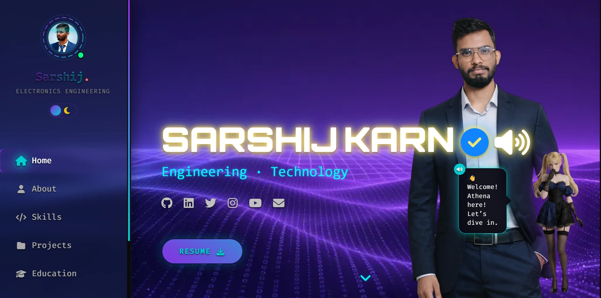

<div align="center">

<!-- HERO SECTION -->


### _Hello! Nice To Meet You_

<p align="center">
  <a href="https://sarshijkarn.com.np"></a>
  <a href="#"></a>
  <a href="#"></a>
</p>

**A futuristic, bulletproof portfolio website featuring real-time animations, advanced security, and a cyberpunk aesthetic that screams 2026.**

[🚀 View Live](https://sarshijkarn.com.np)

</div>

---

## 🛠️ Technology Toolbox

### **Front-End Mastery**

<p align="left">
  
  
  
  
  
  
</p>

### **Back-End & API Infrastructure**

<p align="left">
  
  
  
  
  
  
</p>

### **Cyber-Security Suite**

<p align="left">
  
  
  
  
</p>

### **DevOps & Analytics**

<p align="left">
  
  
  
  
  
</p>

---

## 📊 Codebase Statistics

<div align="center">

<!-- Auto-generated metrics based on source files -->

| File System           | Logic/Content           | Lines of Code | Composition                    |
| :-------------------- | :---------------------- | :-----------: | :----------------------------- |
| **🎨 Global Styles**  | `assets/css/style.css`  |   **3,599**   | `██████████░░░░░░░░░░` **53%** |
| **🌐 Core Structure** | `index.html`            |   **1,354**   | `████░░░░░░░░░░░░░░░░` **20%** |
| **⚡ Client Logic**   | `assets/js/script.js`   |   **1,289**   | `████░░░░░░░░░░░░░░░░` **19%** |
| **🛡️ Serverless API** | `api/contact.js`        |    **407**    | `█░░░░░░░░░░░░░░░░░░░` **6%**  |
| **🧊 3D Engine**      | `assets/js/3d-scene.js` |    **125**    | `░░░░░░░░░░░░░░░░░░░░` **2%**  |

### **Total Project Size:** ~6,800 Lines

_(Excluding external libraries & assets)_

</div>

---

## ✨ Feature Showcase

<table>
  <tr>
    <td width="50%" valign="top">
      
### 🎨 **Design Excellence**
      
- 🌑 **Dark Mode Optimized** - Eye-friendly cyberpunk theme
- ✨ **Neural-Aura Effects** - Holographic overlays & glows
- 📱 **Fully Responsive** - Perfect on all devices
- 🎬 **GSAP Animations** - Buttery smooth 60fps
- 🔮 **Glitch Effects** - Dynamic text scrambling
- 🎯 **Parallax Scrolling** - Immersive depth
      
    </td>
    <td width="50%" valign="top">
      
### 🛡️ **Security First**
      
- 🤖 **Cloudflare Turnstile** - Bot protection
- 🚫 **Persistent Rate Limiting** - Upstash Redis (5 req/hr/IP)
- 🔒 **XSS Prevention** - All inputs sanitized
- 🌐 **CORS Whitelist** - Origin-based blocks
- 📧 **Email Validation** - Blocklist + regex
- 🧮 **Math Challenges** - Terminal mode security
      
    </td>
  </tr>
</table>

### 🎯 **Unique Features**

<details>
<summary><b>⌨️ Cyber Terminal Mode</b> (Click to expand)</summary>

```bash
root@sarshij:~$ contact
SECURITY CHECK: What is 7 + 3?
> 10
ACCESS GRANTED. Initiation sequence started. Enter your name:
> Sarshij Karn
SUCCESS: ID confirmed as 'Sarshij Karn'. Enter neural-mail:
> test@example.com
SUCCESS: Uplink address verified. Enter your transmission data:
> Hello from the terminal!
SYSTEM: Encrypting and transmitting data packet...
SYSTEM: ✅ TRANSMISSION SUCCESSFUL. Uplink terminated.
```

**Features:**

- CLI-style interface for developers
- Math-based human verification
- HTML injection protection
- Real-time command processing

</details>

<details>
<summary><b>📧 Smart Contact System</b> (Click to expand)</summary>

**Dual Mode Contact:**

1. **Standard Form** - Beautiful UI with CAPTCHA
2. **Terminal Mode** - CLI interface with math challenge

**Validations:**

- ✅ Name: 2-100 characters
- ✅ Email: Strict W3C regex + domain blocklist
- ✅ Message: 10-5000 characters
- ✅ CAPTCHA: Cloudflare Turnstile verification
- ✅ Rate Limit: 5 submits per hour per IP (Redis-backed persistent storage)

**Notifications:**

- 📧 Admin email via Resend API
- 🔔 Discord webhook alert
- ✉️ Auto-reply to user

</details>

<details>
<summary><b>🧚‍♀️ Holo-Companion "Athena"</b> (Click to expand)</summary>

**An intelligent, interactive mascot that guides visitors.**

- **🗣️ Voice-Enabled:** Greets visitors and speaks on interaction (Text-to-Speech).
- **📱 Responsive:** Automatically enters "Mini Mode" on mobile devices.
- **🖱️ Draggable:** Move her anywhere on the screen (Desktop).
- **🧠 Context-Aware:** Shares facts about Sarshij, site tips, and hidden easter eggs.
- **✨ Animated:** Reacts with spins, waves, and bounces (Glassmorphism UI 2.0).

</details>

<details>
<summary><b>🛡️ Audit & Security Updates (Feb 2026)</b> (Click to expand)</summary>

- ✅ **Link Security:** All external links secured with `rel="noopener noreferrer"`.
- ✅ **RFC 9116:** Standardized `/.well-known/security.txt` implemented.
- ✅ **HSTS:** Strict-Transport-Security headers reinforced.
- ✅ **Open Graph:** Enhanced social preview cards for 2026.

</details>

---

### **File Structure**

```
My-Website/
┣ 📂 api/
┃ ┗ 📜 contact.js                    ← Serverless handler (SECURED)
┣ 📂 assets/
┃ ┣ 📂 css/
┃ ┃ ┣ 📜 tailwind.css                ← Static build
┃ ┃ ┣ 📜 style.css                   ← Main cyberpunk styles
┃ ┃ ┗ 📜 project-icons.css           ← Animated SVG icons
┃ ┣ 📂 icons/
┃ ┃ ┣ 🖼️ favicon.ico
┃ ┃ ┣ 🖼️ favicon-32x32.webp
┃ ┃ ┣ 🖼️ favicon-48x48.webp
┃ ┃ ┗ 🖼️ apple-touch-icon.webp
┃ ┣ 📂 img/
┃ ┃ ┣ 🖼️ HomepageFix.webp            ← Hero image
┃ ┃ ┣ 🖼️ me.webp                     ← Profile photo
┃ ┃ ┗ 🖼️ bg.webp                     ← Background
┃ ┣ 📂 js/
┃ ┃ ┗ 📜 script.js                   ← Client logic + sanitization
┃ ┗ 📄 Sarshij-Karn-Resume.pdf       ← Downloadable resume
┣ 📂 backup/
┃ ┗ 📜 style.css.bak                 ← Legacy backup
┣ 📂 config/
┃ ┗ 📜 update-version.js             ← Auto-versioning script
┣ 📜 tailwind.config.js              ← Tailwind configuration
┣ 📜 index.html                       ← Main HTML
┣ 📜 404.html                         ← Error page
┣ 📜 site.webmanifest                 ← PWA manifest
┣ 📜 robots.txt                       ← SEO crawler rules
┣ 📜 sitemap.xml                      ← Sitemap
┣ 📜 BingSiteAuth.xml                 ← Bing verification
┣ 📜 CNAME                            ← Custom domain
┣ 📜 .htaccess                        ← Server config
┣ 📜 vercel.json                      ← Deployment config (strict CORS)
┣ 📜 package.json                     ← Dependencies
┗ 📖 README.md                        ← You are here!
```

---

## 🛡️ Security Architecture

### **Security Features Matrix**

<table>
  <tr>
    <th>Feature</th>
    <th>Type</th>
    <th>Status</th>
    <th>Protection Against</th>
  </tr>
  <tr>
    <td>🤖 <b>Cloudflare Turnstile</b></td>
    <td>CAPTCHA</td>
    <td></td>
    <td>Bots, Automated Scripts</td>
  </tr>
  <tr>
    <td>🚫 <b>Rate Limiting</b></td>
    <td>Throttling</td>
    <td></td>
    <td>DDoS, Spam, Brute Force</td>
  </tr>
  <tr>
    <td>🔒 <b>XSS Prevention</b></td>
    <td>Sanitization</td>
    <td></td>
    <td>Script Injection, XSS</td>
  </tr>
  <tr>
    <td>🌐 <b>CORS Whitelist</b></td>
    <td>Origin Filter</td>
    <td></td>
    <td>CSRF, Unauthorized Access</td>
  </tr>
  <tr>
    <td>📧 <b>Email Blocklist</b></td>
    <td>Validation</td>
    <td></td>
    <td>Disposable Emails, Fake IDs</td>
  </tr>
  <tr>
    <td>🧮 <b>Math Challenge</b></td>
    <td>Proof of Work</td>
    <td></td>
    <td>Terminal Bots</td>
  </tr>
  <tr>
    <td>🛡️ <b>HTTP Security Headers</b></td>
    <td>Browser Policy</td>
    <td></td>
    <td>HSTS, Referrer-Policy</td>
  </tr>
</table>

## 🚀 Quick Start

### **Prerequisites**

```bash
Node.js >= 18.0.0
npm >= 9.0.0
Vercel CLI (optional)
```

### **Installation Wizard**

<details>
<summary><b>Step 1: Clone Repository</b></summary>

```bash
git clone https://github.com/sarshij/my-website-main.git
cd my-website-main
```

</details>

<details>
<summary><b>Step 2: Install Dependencies</b></summary>

```bash
npm install
```

**Dependencies installed:**

- `axios` - HTTP client for Resend/Discord
- `tailwindcss` - CSS framework

</details>

<details>
<summary><b>Step 3: Get Cloudflare Turnstile Keys</b></summary>

1. Go to [Cloudflare Turnstile Dashboard](https://dash.cloudflare.com/?to=/:account/turnstile)
2. Click **"Add Site"**
3. Fill in:
   - **Widget Name:** `Captchaa` (or your choice)
   - **Hostname:** `sarshijkarn.com.np`
   - **Widget Mode:** `Managed`
4. Click **"Create"**
5. Copy the keys:
   - **Site Key** (starts with `0x4...`)
   - **Secret Key** (starts with `0x4...`)

</details>

<details>
<summary><b>Step 4: Configure Environment Variables</b></summary>

#### **Option A: Local Development (.env file)**

Create `.env` in the root:

```env
# Email Service (Resend.com)
EMAIL_USER=your-email@example.com
EMAIL_PASS=re_123456789...
ADMIN_EMAIL=admin@example.com

# Discord Webhook (Optional)
DISCORD_WEBHOOK_URL=https://discord.com/api/webhooks/...

# Cloudflare Turnstile (REQUIRED)
TURNSTILE_SECRET_KEY=0x4AAAAAAA...

# Upstash Redis (REQUIRED for Rate Limiting)
UPSTASH_REDIS_REST_URL=https://...
UPSTASH_REDIS_REST_TOKEN=...

```

#### **Option B: Vercel Deployment**

1. Go to **Vercel Dashboard** → Your Project → **Settings**
2. Navigate to **Environment Variables**
3. Add each variable above

</details>

<details>
<summary><b>Step 5: Update Site Key in HTML</b></summary>

Open `index.html` → **Line 1269**:

```html
<!-- BEFORE -->
<div
  class="cf-turnstile"
  data-sitekey="YOUR_SITE_KEY_HERE"
  data-theme="dark"
></div>

<!-- AFTER (paste your Site Key) -->
<div
  class="cf-turnstile"
  data-sitekey="YOUR_TURNSTILE_SITE_KEY"
  data-theme="dark"
></div>
```

> ✅ **Already done!** Site key is: `YOUR_TURNSTILE_SITE_KEY`

</details>

<details>
<summary><b>Step 6: Deploy</b></summary>

#### **Local Development:**

```bash
vercel dev
```

Visit: `http://localhost:3000`

#### **Production Deployment:**

```bash
vercel --prod
```

Or push to GitHub and connect to Vercel for auto-deployment.

</details>

---

## ⚙️ Configuration

### **Environment Variables Reference**

| Variable                   | Type   | Required | Description                    |
| -------------------------- | ------ | -------- | ------------------------------ |
| `EMAIL_USER`               | String | Yes      | Resend sender email            |
| `EMAIL_PASS`               | String | Yes      | Resend API key                 |
| `ADMIN_EMAIL`              | String | Yes      | Your email to receive messages |
| `DISCORD_WEBHOOK_URL`      | String | No       | Discord channel webhook        |
| `TURNSTILE_SECRET_KEY`     | String | **Yes**  | Cloudflare secret key          |
| `UPSTASH_REDIS_REST_URL`   | String | **Yes**  | Upstash Redis URL              |
| `UPSTASH_REDIS_REST_TOKEN` | String | **Yes**  | Upstash Redis Token            |

---

## 📞 Contact

<div align="center">


### **SARSHIJ KARN**

_Electronics Engineer • AI Enthusiast • Cybersecurity Explorer_

<p>
  <a href="https://sarshijkarn.com.np"></a>
  <a href="mailto:sarshijkarn333@gmail.com"></a>
</p>

<p>
  <a href="https://github.com/sarshij"></a>
  <a href="https://www.linkedin.com/in/sarshij-karn-1a7766236/"></a>
  <a href="https://twitter.com/sarshijkarn"></a>
</p>

**Location:** Kathmandu, Nepal 🇳🇵  
**Currently:** B.E. Electronics, Communication & Information Engineering

</div>

---

### **Technologies Powered By**

<p align="center">
  
  
  
  
  
  
</p>

---

<div align="center">


**Made with 💜 by [Sarshij Karn](https://sarshijkarn.com.np)**  
_Building the future, one commit at a time._

**Last Updated:** February 14, 2026

</div>
